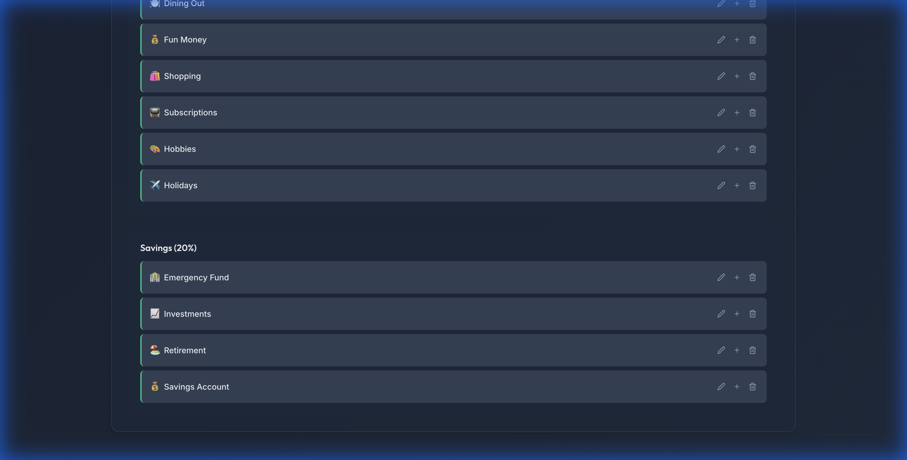
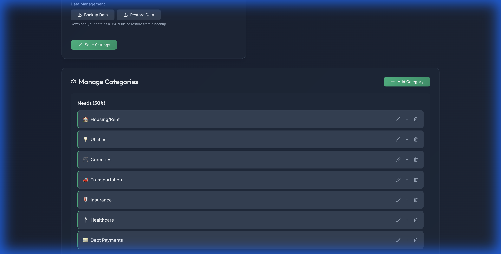

# Simple Finance 💰

A modern, privacy-focused personal finance tracker built to help you master the **50/30/20 rule**.


*(Replace with actual dashboard screenshot)*

## ✨ Features

- **📊 Smart Budgeting**: Automatically categorizes spending into **Needs (50%)**, **Wants (30%)**, and **Savings (20%)**.
- **⚡️ Expense Ledger**: A high-speed, Excel-like interface for rapid data entry and inline editing.
- **📈 Visual Analytics**: Interactive charts for monthly trends, category breakdowns, and income vs. expenses.
- **🛡️ Privacy First**: Your data lives in your browser (`localStorage`). No servers, no accounts, no tracking.
- **💾 Backup & Restore**: Export your financial history to JSON and restore it on any device.
- **📅 Yearly Overview**: Cumulative views to track your progress over the entire year.

## 🚀 Tech Stack

- **Framework**: [React](https://react.dev/) + [Vite](https://vitejs.dev/)
- **Language**: [TypeScript](https://www.typescriptlang.org/)
- **Styling**: Vanilla CSS (Modern Variables & Flexbox/Grid)
- **Icons**: [Lucide React](https://lucide.dev/)
- **Charts**: [Recharts](https://recharts.org/)

## 🛠️ Getting Started

### Prerequisites

- Node.js (v18 or higher)
- npm or yarn

### Installation

1.  Clone the repository:
    ```bash
    git clone https://github.com/yourusername/simple-finance.git
    cd simple-finance
    ```

2.  Install dependencies:
    ```bash
    npm install
    ```

3.  Start the development server:
    ```bash
    npm run dev
    ```

## 📦 Deployment

This project is configured for **GitHub Pages**.

1.  Update `vite.config.ts` with your repository name:
    ```typescript
    base: '/simple-finance/', // Replace with your repo name
    ```

2.  Deploy with a single command:
    ```bash
    npm run deploy
    ```

## 📸 Screenshots

### Expense Ledger
*Rapidly add and edit expenses with a spreadsheet-like interface.*


### Data Management
*Securely backup and restore your data.*


## 📄 License

MIT License - feel free to use this for your own financial journey!
